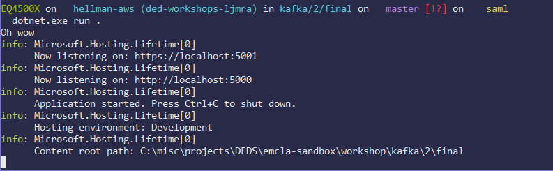
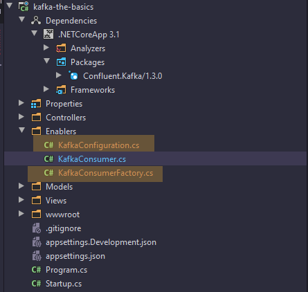
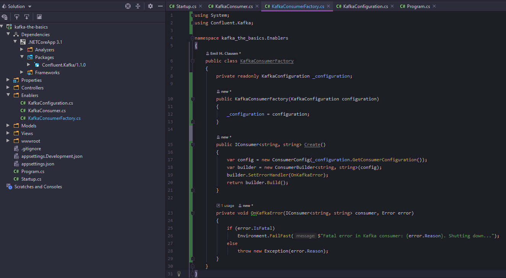

## Kafka in code

All right, so now that we have verified that our local Kafka setup works, it is time to do somewhat the same, but in code instead. We'll be using C# with .NET Core, since that seems to be the predominant programming language used within DFDS.

## .NET Core 3.1

Go to https://dotnet.microsoft.com/download/dotnet-core/3.1, download the latest 3.1 SDK and install it.

## Project base

Open the 'ded-dojo/kafka-the-basics/2/project' directory found in the git repository you cloned in the last kata, in your preferred IDE/text editor, as well as in a terminal emulator.

In the terminal, run the following command

`dotnet add package Confluent.Kafka --version 1.1.0`

In the root of the project directory, create another directory that we will call "Enablers". Within that directory, create a Class called "KafkaConsumer".


If you're an experienced .NET developer, you might have already noticed that the project structure looks awfully similar to an ASP project, because it is indeed just that. A quick look inside *Program.cs* will reveal that the Main thread will be running a web server.

With that in mind, we would like our KafkaConsumer to run alongside that. Let us turn *KafkaConsumer* into a "HostedService". That is done by merely just making sure that *KafkaConsumer* implements *IHostedService*, like shown below.

```c#
using System;
using System.Threading;
using System.Threading.Tasks;
using Microsoft.Extensions.Hosting;

namespace kafka_the_basics.Enablers
{
    public class KafkaConsumer : IHostedService
    {
        public Task StartAsync(CancellationToken cancellationToken)
        {
            throw new System.NotImplementedException();
        }

        public Task StopAsync(CancellationToken cancellationToken)
        {
            throw new System.NotImplementedException();
        }
    }
}
```


Now let us turn our attention to the "Startup.cs" file located in the root project directory. For the ASP framework to pick up our *KafkaConsumer* service, we will have to explicitly tell it that.

To do that, we gotta find the *ConfigureServices* method within the *Startup* Class. In that method, we gotta add the following line: `services.AddHostedService<KafkaConsumer>();`


We should probably make sure that what we have just done in the past few steps actually works. Go back to the *KafkaConsumer* Class. Within the StartAsync, write some text to the Console, to verify that the ASP framework does indeed run our *KafkaConsumer* service.

```c#
using System;
using System.Threading;
using System.Threading.Tasks;
using Microsoft.Extensions.Hosting;

namespace kafka_the_basics.Enablers
{
    public class KafkaConsumer : IHostedService
    {
        public Task StartAsync(CancellationToken cancellationToken)
        {
            Console.WriteLine("Oh wow");
            return Task.CompletedTask;
        }

        public Task StopAsync(CancellationToken cancellationToken)
        {
            throw new System.NotImplementedException();
        }
    }
}
```

 

Run the project by executing the following command in your terminal emulator, at the project root directory(workshop/kafka/2/project)

`dotnet run .`

If everything is working as expected, the output should look a bit like how it is below:


If it doesn't, please do ask for help!

If it does, great! Let us continue.

Time to complete the base foundation of our *KafkaConsumer*.

```c#
using System;
using System.Threading;
using System.Threading.Tasks;
using Microsoft.Extensions.Hosting;

namespace kafka_the_basics.Enablers
{
    public class KafkaConsumer : IHostedService
    {
        private readonly CancellationTokenSource _cancellationTokenSource = new CancellationTokenSource();
        private Task _executingTask;
        public Task StartAsync(CancellationToken cancellationToken)
        {
            _executingTask = Task.Factory.StartNew(async () =>
                    {
                        // Kafka Consume loop
                    }, _cancellationTokenSource.Token,
                    TaskCreationOptions.LongRunning, TaskScheduler.Default)
                .ContinueWith(task =>
                {
                    if (task.IsFaulted)
                    {
                        Console.WriteLine("Event loop crashed");
                    }
                }, cancellationToken);
            
            return Task.CompletedTask;
        }

        public async Task StopAsync(CancellationToken cancellationToken)
        {
            try
            {
                _cancellationTokenSource.Cancel();
            }
            finally
            {
                await Task.WhenAny(_executingTask, Task.Delay(-1, cancellationToken));
            }
            
            _cancellationTokenSource.Dispose();
        }
    }
}
```


Brilliant. Time to finally touch the Confluent.Kafka library we added all the way back in the beginning of this.

## Confluent.Kafka

So the *Confluent.Kafka* library has it fair share of weird quirks. Instead of being a pure C# implementation, it is more or less a wrapper around Confluent's C library, *librdkafka*. Now, there is nothing inherently wrong with that, but let us just say that you can definitely feel the effects of that in their C# wrapper, *Confluent.Kafka*.

A fellow DFDS team, known as P-Project, has created a wrapper around Confluent's wrapper(Confluent.Kafka), which they call [*DAFDA*](https://github.com/dfds/dafda). DAFDA seeks to remedy and easen the quirks of the *Confluent.Kafka* library.

In order to better understand why *DAFDA* was created, we won't be using it, but will rather be using *Confluent.Kafka* as it, and all the extra boilerplate code that comes with it.

All right. Let us create a couple of classes that will help us with creating a Consumer. In the "Enablers" directory, create a file for each of the following classes

* KafkaConsumerFactory
* KafkaConfiguration

It should look a bit like this



We will start with the *KafkaConfiguration* Class, as it will be needed in the *KafkaConsumerFactory*.

*Confluent.Kafka* has no decent built-in way of handling outside Configuration(e.g. by setting an environment variable or reading a config file), so we will be doing that, with environment variables as our method of configuration.

```c#
using System;
using System.Collections.Generic;
using System.Linq;
using Confluent.Kafka;
using Microsoft.Extensions.Configuration;

namespace kafka_the_basics.Enablers
{
    public class KafkaConfiguration
    {
        private const string KEY_PREFIX = "KAFKATHEBASICS_KAFKA_";
        private readonly IConfiguration _configuration;

        public KafkaConfiguration(IConfiguration configuration)
        {
            _configuration = configuration;
        }

        private string Key(string keyName) => string.Join("", KEY_PREFIX, keyName.ToUpper().Replace('.', '_'));

        private Tuple<string, string> GetConfiguration(string key)
        {
            var value = _configuration[Key(key)];

            if (string.IsNullOrWhiteSpace(value))
            {
                return null;
            }

            return Tuple.Create(key, value);
        }
        
        public ConsumerConfig GetConsumerConfiguration()
        {
            return new ConsumerConfig(AsEnumerable());
        }

        public ProducerConfig GetProducerConfiguration()
        {
            return new ProducerConfig(AsEnumerable());
        }


        public IEnumerable<KeyValuePair<string, string>> AsEnumerable()
        {
            var configurationKeys = new[]
            {
                "group.id",
                "enable.auto.commit",
                "bootstrap.servers",
                "broker.version.fallback",
                "api.version.fallback.ms",
                "ssl.ca.location",
                "sasl.username",
                "sasl.password",
                "sasl.mechanisms",
                "security.protocol",
            };
            
            var config = configurationKeys
                .Select(key => GetConfiguration(key))
                .Where(pair => pair != null)
                .Select(pair => new KeyValuePair<string, string>(pair.Item1, pair.Item2))
                .ToList();
            
            config.Add(new KeyValuePair<string, string>("request.timeout.ms", "3000"));

            return config;
        }
    }
}
```

That was quite the code dump. Let's delve a bit more into some key parts of it.

`private const string KEY_PREFIX = "KAFKATHEBASICS_KAFKA_";`

The above code snippet allows us to use a prefix for all our configuration environment variables, thereby allowing for the potential of connecting to multiple different Kafka servers

```c#
public IEnumerable<KeyValuePair<string, string>> AsEnumerable()
{
    var configurationKeys = new[]
    {
        "group.id",
        "enable.auto.commit",
        "bootstrap.servers",
        "broker.version.fallback",
        "api.version.fallback.ms",
        "ssl.ca.location",
        "sasl.username",
        "sasl.password",
        "sasl.mechanisms",
        "security.protocol",
    };
    
    var config = configurationKeys
        .Select(key => GetConfiguration(key))
        .Where(pair => pair != null)
        .Select(pair => new KeyValuePair<string, string>(pair.Item1, pair.Item2))
        .ToList();
    
    config.Add(new KeyValuePair<string, string>("request.timeout.ms", "3000"));

    return config;
}
```

With the *GetConfiguration* helper method, we're able to use our *KEY_PREFIX* in combination with the specified configuration values above, like "group.id", "bootstrap.servers" and "enable.auto.commit", to find the configurations stored as environment variables.

So, "bootstrap.servers" would in a environment variable with the above code in mind, be "KAFKATHEBASICS_KAFKA_BOOTSTRAP_SERVERS", and "enable.auto.commit" would be "KAFKATHEBASICS_KAFKA_ENABLE_AUTO_COMMIT".

```c#
public ConsumerConfig GetConsumerConfiguration()
{
    return new ConsumerConfig(AsEnumerable());
}

public ProducerConfig GetProducerConfiguration()
{
    return new ProducerConfig(AsEnumerable());
}
```

*GetConsumerConfiguration()* and *GetProducerConfiguration()*, uses the method just before to create a configuration object that *Confluent.Kafka* is capable of interpreting and use.

With our *KafkaConfiguration* Class now ready, it is time to turn our attention to the *KafkaConsumerFactory* Class.


```c#
using System;
using Confluent.Kafka;

namespace kafka_the_basics.Enablers
{
    public class KafkaConsumerFactory
    {
        private readonly KafkaConfiguration _configuration;

        public KafkaConsumerFactory(KafkaConfiguration configuration)
        {
            _configuration = configuration;
        }

        public IConsumer<string, string> Create()
        {
            var config = new ConsumerConfig(_configuration.GetConsumerConfiguration());
            var builder = new ConsumerBuilder<string, string>(config);
            builder.SetErrorHandler(OnKafkaError);
            return builder.Build();
        }
        
        private void OnKafkaError(IConsumer<string, string> consumer, Error error)
        {
            if (error.IsFatal)
                Environment.FailFast($"Fatal error in Kafka consumer: {error.Reason}. Shutting down...");
            else
                throw new Exception(error.Reason);
        }
    }
}
```



Here we make sure of our newly created KafkaConfiguration class to create a *IConsumer* object. *IConsumer* stems from the *Confluent.Kafka* library and is what will allow us to Consume from a Topic.

We now have the necessary tools for us to begin taking a look at the code that will actually allow us to interact with Kafka. Time to return to the *KafkaConsumer* Class we created earlier on.

```c#
using System;
using System.Threading;
using System.Threading.Tasks;
using Confluent.Kafka;
using Microsoft.Extensions.Hosting;

namespace kafka_the_basics.Enablers
{
    public class KafkaConsumer : IHostedService
    {
        private readonly CancellationTokenSource _cancellationTokenSource = new CancellationTokenSource();
        private readonly KafkaConsumerFactory _consumerFactory;
        private Task _executingTask;

        public KafkaConsumer(KafkaConsumerFactory consumerFactory)
        {
            _consumerFactory = consumerFactory;
        }
        
        public Task StartAsync(CancellationToken cancellationToken)
        {
            _executingTask = Task.Factory.StartNew(async () =>
                    {
                        using (var consumer = _consumerFactory.Create())
                        {
                            const string topic = "build.workshop.something";
                            consumer.Subscribe(topic);
                            Console.WriteLine($"KafkaConsumer started. Listening to topic: {topic}");

                            // Consume loop
                            while (!_cancellationTokenSource.IsCancellationRequested)
                            {
                                ConsumeResult<string, string> msg;
                                try
                                {
                                    msg = consumer.Consume(cancellationToken);
                                }
                                catch (Exception ex)
                                {
                                    Console.WriteLine($"Consumption of message failed, reason: {ex}");
                                    continue;
                                }
                                
                                Console.WriteLine($"Received message: Topic: {msg.Topic}");
                                Console.WriteLine($"Message payload:\n{msg.Value}");

                                try
                                {
                                    await Task.Run(() => consumer.Commit(msg));
                                }
                                catch (Exception ex)
                                {
                                    Console.WriteLine($"Error consuming message: Exception message: {ex.Message}. Raw message: '{msg.Value}'");
                                }
                            }
                        }
                    }, _cancellationTokenSource.Token,
                    TaskCreationOptions.LongRunning, TaskScheduler.Default)
                .ContinueWith(task =>
                {
                    if (task.IsFaulted)
                    {
                        Console.WriteLine("Event loop crashed");
                    }
                }, cancellationToken);
            
            return Task.CompletedTask;
        }

        public async Task StopAsync(CancellationToken cancellationToken)
        {
            try
            {
                _cancellationTokenSource.Cancel();
            }
            finally
            {
                await Task.WhenAny(_executingTask, Task.Delay(-1, cancellationToken));
            }
            
            _cancellationTokenSource.Dispose();
        }
    }
}
```

It has now grown considerably compared to before. Let's go through some of it.


```c#
public class KafkaConsumer : IHostedService
{
    private readonly CancellationTokenSource _cancellationTokenSource = new CancellationTokenSource();
    private readonly KafkaConsumerFactory _consumerFactory;
    private Task _executingTask;

    public KafkaConsumer(KafkaConsumerFactory consumerFactory)
    {
        _consumerFactory = consumerFactory;
    }
```

We now make use of the *KafkaConsumerFactory* we have created, and make sure an instance of it is available in the Class.

In *StartAsync*:

`using (var consumer = _consumerFactory.Create())`

The *KafkaConsumerFactory* is used to create an instance of *IConsumer*.

```c#
const string topic = "build.workshop.something";
consumer.Subscribe(topic);
```

After that, we hard code(can be done with environment variables like we did with the rest of the configuration) the name of the Topic we wanna consume from, and subsequently tell our *IConsumer* instance to start consuming from that Topic.

```c#
while (!_cancellationTokenSource.IsCancellationRequested)
{
    ...
}
```

After that, we create a while loop that will keep running unless our cancellationToken has been triggered.

```c#
ConsumeResult<string, string> msg;
try
{
    msg = consumer.Consume(cancellationToken);
}
catch (Exception ex)
{
    Console.WriteLine($"Consumption of message failed, reason: {ex}");
    continue;
}

Console.WriteLine($"Received message: Topic: {msg.Topic}");
Console.WriteLine($"Message payload:\n{msg.Value}");
```

Within that while loop, we use the *IConsumer* instance to Consume a message. The `consumer.Consume(cancellationToken)` call will block, and keep polling until a message has been received. When a message is received, we merely just print it to the Console.

```c#
try
{
    await Task.Run(() => consumer.Commit(msg));
}
catch (Exception ex)
{
    Console.WriteLine($"Error consuming message: Exception message: {ex.Message}. Raw message: '{msg.Value}'");
}
```

After that, we **Commit** the message. This is a concept that I didn't introduce during the presentation. What commiting a message means, is essentially that we tell the Kafka server that the ConsumerGroup that our Consumer uses, has seen and handled the message. If we don't Commit the message, our code will consume it again(assuming the Kafka server hasn't throw the message away, e.g. it's past a certain amount of days).

And that was pretty much our consume loop. It'll continue, unless it runs into an uncaught Exception.

If we try and run the project now, it should fail during runtime execution. We've created a couple of Classes, and within some of those classes, let dependency injection handle creation of those Classes. However, the ASP framework isn't quite aware of all these new Classes yet, so let's go and make sure it is. Open up "Startup.cs" from the root project directory.

Like in the start of this kata, where we modified the *ConfigureServices* method, we gotta do that once again. Ensure it looks somewhat like this:

```c#
public void ConfigureServices(IServiceCollection services)
{
    services.AddControllersWithViews();

    services.AddTransient<KafkaConfiguration>();
    services.AddTransient<KafkaConsumerFactory>();
    services.AddHostedService<KafkaConsumer>();
}
```

Let us try and see it in action.

Go to "workshop/kafka/2" in a terminal emulator, and execute the following:

`docker-compose up --build`

If the output of the above command didn't fail(if it did, ask for help), in a separate terminal emulator, execute the following:

`docker run -it --rm --network=development edenhill/kafkacat:1.5.0 -P -b kafka:9092 -t build.workshop.something`

Now, ensure you can see both terminal emulators. In the terminal emulator you last opened up, do like the previous Kata. Type a message and press ENTER.

If everything is working as expected, you should see the message in the other terminal emulator window.

---
Great! We now have a .NET Core project that can **Consume** from a **Topic**. In the third kata, we will expand upon that code, and **Produce** to a **Topic**.