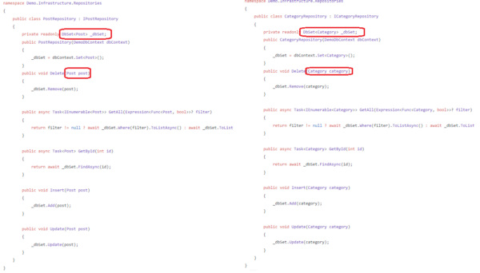

Design Patterns - Observer Pattern
======================================

## Getting started
This tutorial will help you understand the repository pattern, generic repository pattern and unit of work. Ensure that your machine has the tools.


### Prerequisites
* [Visual Studio](https://docs.microsoft.com/en-us/visualstudio/install/install-visual-studio?view=vs-2022)
* [SQL Server Management Studio](https://docs.microsoft.com/en-us/sql/ssms/download-sql-server-management-studio-ssms?view=sql-server-ver16)


## Repository Pattern & Generic Repository Pattern
The repository pattern is often used with ORM tools to handle the operations in the data access layer. When we use this pattern, we decrease the load in the application layer and separate concerns. To better understand these patterns, let's create a REST Web API. Consider that you want to create a blog project in .NET6. In the first step, you need to identify entities(models).
 **What entities do you need in this project?** 
You might need to create some of the following entities: Post, Category, Tag, Comment… Let's create two entities mentioned above and compare two cases(with and without repository pattern). Then, we're going to implement generic repository pattern. You can see the entities below:
**Do not forget to read the comments in the code to understand better**😜
#### Post.cs
```c#
// In the furher steps we will modify this class.
namespace BarisTutakli.Blog.Domain.Entities
{
    public class Post
    {
        public int Id { get; set; }
        public string Title { get; set; }
        public string MetaTitle { get; set; }
        public string Summary { get; set; }
        public string Body { get; set; }
    }
}
```
#### Category.cs
```c#
// In the furher steps we will modify this class.
namespace BarisTutakli.Blog.Domain.Entities
{
    public class Category
    {
        public int Id { get; set; }
        public string Title { get; set; }
        public string MetaTitle { get; set; }
        public virtual ICollection<Post> Posts { get; set; }
    }
}
```
Assume that we want to get a post by a specific id, get all posts, add a new post, update a specific post and delete a specific post(CRUD operations). Let's start by creating an IPostRepository, ICategoryRepository interfaces and their implementations.

#### IPostRepository
```c#
using BarisTutakli.Blog.Domain.Entities;
using System.Linq.Expressions;

namespace Demo.Domain.Repositories
{
    public interface IPostRepository
    {
        /// <summary>
        /// Get a specific post(model) by id.
        /// </summary>
        /// <param name="id"></param>
        /// <returns></returns>
        Task<Post> GetById(int id);

        /// <summary>
        /// Get entities depending on the filter
        /// </summary>
        /// <param name="filter"></param>
        /// <returns></returns>
        Task<IEnumerable<Post>> GetAll(Expression<Func<Post, bool>>? filter = null);
        /// <summary>
        /// Insert new post
        /// </summary>
        /// <param name="post"></param>
        void Insert(Post post);
        /// <summary>
        /// Delete an post
        /// </summary>
        /// <param name="post"></param>
        void Delete(Post post);
        /// <summary>
        /// Update an post
        /// </summary>
        /// <param name="post"></param>
        void Update(Post post);

    }
}
```
#### ICategoryRepository
```c#
using BarisTutakli.Blog.Domain.Entities;
using System.Linq.Expressions;

namespace Demo.Domain.Repositories
{
    public interface ICategoryRepository
    {
        /// <summary>
        /// Get a specific Category(model) by id.
        /// </summary>
        /// <param name="id"></param>
        /// <returns></returns>
        Task<Category> GetById(int id);

        /// <summary>
        /// Get entities depending on the filter
        /// </summary>
        /// <param name="filter"></param>
        /// <returns></returns>
        Task<IEnumerable<Category>> GetAll(Expression<Func<Category, bool>>? filter = null);
        /// <summary>
        /// Insert new Category
        /// </summary>
        /// <param name="Category"></param>
        void Insert(Category category);
        /// <summary>
        /// Delete a category
        /// </summary>
        /// <param name="category"></param>
        void Delete(Category category);
        /// <summary>
        /// Update a category
        /// </summary>
        /// <param name="category"></param>
        void Update(Category category);

    }
}
```
As we can not create an instance of interfaces, we need to implement these two interfaces. So, let's create PostRepository and CategoryRepository classes. 
**Did you notice something in common between PostRepository and Category repository?**
You can find the source code in the demo app.


Yep, you are right!!! They look pretty much the same except for a few changes such as method parameters, return value types, etc. 
How can we
* avoid code repetitions?
* type safety

As our entities are classes, we can restrict our generic repository with **class** and **new()** keywords that will restrict someone to put any type. Why not restrict the generic repository by a base type? Let's restrict again our generic class using a base entity type that will be inherited by all the entities! 
So, isn't it better to create an abstract class that will derive our entities as below:

#### BaseEntity.cs
```c#
namespace Demo.Domain.Common;
public abstract class BaseEntity
{
    /// <summary>
    /// This is a common property of posts, categories, tags and comments because they are the entities. 
    /// They have unique ids which differ them from value objects
    /// If you want, you can add or remove more properties 
    /// </summary>
    public int Id { get; set; }
}
```

#### Post.cs
```c#
using Domain.Common;

namespace BarisTutakli.Blog.Domain.Entities
{
    public class Post:BaseEntity
    {
        public string Title { get; set; }
        public string MetaTitle { get; set; }
        public string Summary { get; set; }
        public string Body { get; set; }
    }
}
```
Don't forget to read the comments in the code:) Now we can create the generic class as below:
It's time to refactor PostRepository and CategoryRepository😀 Here you can see that repositories are derived from GenericRepository class and act like their parents. As Post repository and Category repository inherit behaviors of parent class, we don't need to write the same methods(GetById, GetAll…) again. If you want do override these methods, you should use **virtual** or **abstract** keywords depending on your aim. In addition, If you want to extend this PostRepository … , you can also use the **Decorator Pattern**.

## Generic Repository 

**Do not forget to read the comments in the code to understand better**😜
```c#
namespace Demo.Infrastructure.Repositories
{
    public class GenericRepository<TEntity> : IRepository<TEntity>where  TEntity: BaseEntity
    {
        /// <summary>
        /// It's protected because I wanted to be able to access this field from the children(PostRepository,CategoryRepository, TagRepository...) of this baseRepository.
        /// </summary>
        protected readonly DbSet<TEntity> DbSet;
        public GenericRepository(DemoDbContext dbContext) => DbSet = dbContext.Set<TEntity>();
        public void Delete(TEntity entity) => DbSet.Remove(entity);

        public async Task<IEnumerable<TEntity>> GetAll(Expression<Func<TEntity, bool>>? filter) => 
            filter != null ? await DbSet.Where(filter).ToListAsync() : await DbSet.ToListAsync();

        public async Task<TEntity> GetById(int id) => await DbSet.FindAsync(id);

        public void Insert(TEntity entity) => DbSet.Add(entity);

        public void Update(TEntity entity) => DbSet.Update(entity);
    }
}
```

Let's update PostRepository by inheriting generic repository.
```c#
using Infrastructure.Repositories;

namespace Demo.Infrastructure.Repositories
{
    public class PostRepository : GenericRepository<Post>, IPostRepository
    {
        public PostRepository(DemoDbContext dbContext) : base(dbContext)
        {

        }

        // You can add new features to this repository to do data operations.
    }
}
```
In this project, I'm not going to add business logic because the article aims to create a REST API to explain repository pattern, generic repository pattern, unit of work, and docker and containerize an API.

Now you saw how to implement the repository and generic repository pattern to your project. Let me show you two different ways of doing data access operations like create, update, delete… That will help you to understand the benefit of repository, generic repository pattern and unit of work. Then, you can decide one of them which suits best for you.

## Injecting DbContext Into Controller

```c#
namespace Demo.API.Controllers
{
    [Route("api/[controller]")]
    [ApiController]
    public class PostController : ControllerBase
    {
        private readonly DbSet<Post> _dbSet;
        public PostController(DbContext context)
        {
                _dbSet = context.Set<Post>();
        }
        // GET: api/<PostController>
        [HttpGet]
        public async Task<IActionResult> Get()
        {
            // Add Business logic
            // For instance, you can add some c# conditional statements..
            // Here you can also make validation, mapping, etc.
            // As you see this contoller have a lot of responsibilities
            var result = await _dbSet.ToListAsync();
            return result != null ? Ok(result) : StatusCode(500);
        }

        // GET api/<PostController>/5
        [HttpGet("{id}")]
        public string Get(int id)
        {
            // Add Business logic
            // For instance, you can add some c# conditional statements..
            // Here you can also make validation, mapping, etc.
            // As you see this contoller have a lot of responsibilities
            return "whatever you want as above ";
        }

    }
}
```
## Injecting Repository Into Controller

Even though we don't use DbContext in controller,  there are still a lot of code which might be moved into a business or service class. You can create a service and move the business code into this service.
```c#
namespace Demo.API.Controllers
{
    [Route("api/[controller]")]
    [ApiController]
    public class PostController : ControllerBase
    {
        private readonly IPostRepository _postRepository;
        public PostController(IPostRepository postRepository)
        {
            _postRepository = postRepository;
        }
        // GET: api/<PostController>
        [HttpGet]
        public async Task<IActionResult> Get()
        {
            // Even though we don't use DbContext in controller,
            // there are still a lot of code which might be moved into a business or service
            // Add Business logic
            // For instance, you can add some c# conditional statements..
            // Here you can also make validation, mapping, etc.
            // As you see this contoller have a lot of responsibilities
            var result = await _postRepository.GetAll();
            return result != null ? Ok(result) : StatusCode(500);
        }

        // GET api/<PostController>/5
        [HttpGet("{id}")]
        public string Get(int id)
        {
            // Add Business logic
            // For instance, you can add some c# conditional statements..
            // Here you can also make validation, mapping, etc.
            // As you see this contoller have a lot of responsibilities
            return "whatever you want as above ";
        }

    }
}
```

## Unit of Work
In the previous scenario, you inject only PostRepository into Controller. If you needed to inject more repositories, would you inject them the same way you did for the PostRepository? If you prefer this, you will have a controller having a constructor as below:

```c#
private readonly IPostRepository _postRepository;
private readonly ICategoryRepository _categoryRepository;
private readonly ITagRepository _tagRepository;
private readonly ICommentRepository _commentRepository;
public PostController(IPostRepository postRepository, ICategoryRepository categoryRepository, ITagRepository _tagRepository, ICommentRepository commentRepository)
{
    _postRepository = postRepository;
    _categoryRepository = categoryRepository;
    _tagRepository = tagRepository;
    _commentRepository = commentRepository;
}
```

Here are the IUnitOfWork interface and it's implementation
```c#
namespace Infrastructure.UnitOfWorks
{
    public interface IUnitOfWork
    {
        IPostRepository Posts { get; }
        ICategoryRepository Categories { get; }
        int Save();
    }
}
```

```c#
namespace Infrastructure.UnitOfWorks
{
    public class UnitOfWork : IUnitOfWork
    {
        public IPostRepository Posts { get; private set; }
        public ICategoryRepository Categories { get; private set; }

        private readonly DemoDbContext _dbContext;

        public UnitOfWork(IPostRepository posts, ICategoryRepository categories, DemoDbContext dbContext)
        {
            Posts = posts;
            Categories = categories;
            _dbContext = dbContext;
        }
        public int Save() => _dbContext.SaveChanges();
    }
}
```

Let's Injecting Unit of Work into Controller and see the difference. Isn't your code cleaner than before?
```c#
private readonly IUnitOfWork _unitOfWork;
public PostController(IUnitOfWork unitOfWork)
{
    _unitOfWork = unitOfWork;
}
```
Instead of injecting multiple dependencies into controller, we can inject only unit of work and use it as below:
* _unitOFWork.Posts.Get() and _postRepository.Get() will do the same thing
* _unitOFWork.Categories.Get() and _categoryRepository.Get() will do the same thing

Thanks for reading the article and keep in mind that the example is just created to show you how to use this pattern. So, the next step is on you. Research how to implement it according to the needs of the project you are working on and continue to find new ways

## Want to help make our training material better?
 * Want to **log an issue** or **request a new kata**? Feel free to visit our [GitHub site](https://github.com/dfds/dojo/issues).