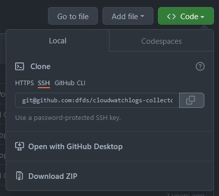

# Introduction to Git, GitHub and VS Code

DFDS Cloud Engineering
Updated January 2022

## Introduction

This presentation is available, both as MarkDown source and rendered PDF, <br>in our open-source *Dojo* repository on GitHub.

<https://github.com/dfds/dojo/blob/master/workshops/git-github-vscode-intro/>

In this repo you can also find many other workshops and associated *katas*.

## Prerequisites & assumptions

The exercises in this workshop has the following prerequisites:

- Up-to-date Windows 10/11 installation
- Have access to run things "as administrator"
- Computer account is in a `Dev` client OU, which has developer policies applied
- All work done in terminal means in a PowerShell terminal
- Windows Terminal is highly recommended, but not particularly needed here

## Agenda (1)

- Git
  - Git concepts
  - Exercise: Install Git
  - Basic Git commands
  - Exercise: Get started with local Git repo
- GitHub
  - Demo: Walk-through of main GitHub features

## Agenda (2)

- Visual Studio Code
  - Demo: Getting started with VS Code
  - VS Code extensions
  - Exercise: Installing VS Code
  - Demo: Cool VS Code features

## Agenda (3)

- Tying it together
  - Configuring Git
  - Exercise: Examine and adjust Git configuration
  - SSH key authentication and GitHub
  - Walk-through exercise: Setup SSH key authentication for GitHub
  - Exercise: Clone a public GitHub repo locally
  - Exercise: Start tracking a local repo
- Overview of Git branches
- Where to go from here

## Git


- Source Code Management (SCM) tool
- Free and open-source
- Created by Linus Torvalds in 2005 for development of the Linux kernel

### Git concepts (1/2)

- Distributed Version Control System
- *Can* work 100% local
  - You can enable version control in any folder
  - No external server or service required
  - But you probably want one
- Tracks changes to files

### Git concepts (2/2)

- Bundle changed files into a commit
  - Commit changes, or...
  - ...revert to previous commit
- Commits should be atomic and frequent

### Exercise: Install Git

- Install via *Software Center*, or
- Download and install from <https://git-scm.com/download/>

### Basic Git commands

| Command           | Effect                                                     |
| ----------------- | ---------------------------------------------------------- |
| `init -b main`    | Initialise a local Git repo in the current directory       |
| `clone <repo>`    | Createa a local clone of the repo at the specified URL     |
| `pull`            | Pull any remote changes from the remote repo (or *origin*) |
| `add <file>`      | *Stage* specified, or all, files for a new *commit*        |
| `commit -m <msg>` | Commit staged files and include the specified message      |
| `push`            | Push local commits to *origin*                             |
| `status`          | Display status of staged files, and local vs. remote repo  |
| `log`             | Display the commit history of the repo                     |

### Exercise: Get started with local Git repo

- Create a common directory to store code, e.g.: `C:\code` or `~/code`
- Create a new sub-directory here (e.g. `github-workshop`), and initialise a local Git repo:

```powershell
cd (New-Item -Name github-workshop -Type Directory)
git init
```

- Create a file, stage and commit it:

```powershell
"Hello" | Out-File -Path hello.txt
git add hello.txt
git commit -m "Initial commit"
```

- Check the commit log to see details about your commit:
  - `git log`

## GitHub


- Free for all, paid tiers available

### Demo: Walk-through of main GitHub features

- Git-as-a-Service
- Issue tracking
- Kanban boards
- GitHub Actions

## Visual Studio Code


Extendable, free, open-source code editor

### Demo: Getting started with VS Code

- Overview
- Keyboard shortcuts :keyboard:
  - `Ctrl`+`Shift`+`P` (or simply `F1`, apparently :exploding_head:)
    - Show the (powerful!) command palette
    - Displays assigned shortcuts (learn and use them)
  - Cheat sheet and more info, see <https://code.visualstudio.com/docs/getstarted/keybindings>.
- Git integration

### VS Code extensions

- VS Code is extendable via a wide range of extensions
- Features include:
  - VS Code UI themes
  - Auto-formatting code
  - Linting and security scanning
- Out-of-scope for this workshop

### Exercise: Installing VS Code

- Download and install from <https://code.visualstudio.com/>
- Local admin rights not required
- Built-in auto-update

*Do not recommend installing via Software Center as this installs "per-machine",<br>and has a slower update cycle.*

### Demo: Cool VS Code features

Short introduction to useful VS Code features, you can explore further on your own:

- Remote VS code - target WSL, remote computers, Docker containers
  - See [Microsoft: VS Code Remote Development](https://code.visualstudio.com/docs/remote/remote-overview)
- VS Code is built into GitHub - just press `.` when browsing a repo
- "Settings Sync" - syncronise your VS Code settings and preferences across devices
  - Including VS Code in GitHub
  - See <https://code.visualstudio.com/docs/editor/settings-sync>

## Tying it together


### Configuring Git

- Some settings need to be configured to work with remote repositories
- Git configuration has multiple scopes:
  - `system`: Machine-wide (`$GIT_BIN_DIR/etc/gitconfig`)
  - `global`: Current user, all repos (`~/.gitconfig`)
  - `local`: Current repo only (`.git/config`)
- The more specific scope, the higer precedence
  - `local` overrides `global`, which overrides `system`

### Exercise: Examine and adjust Git configuration

- Examine the current Git configuration settings and their scope
- Configure name and email address
- Ensure default branch name for new repos is `main`
- Disable automatic End-of-Line character conversion

```powershell
# List current configuration and scope
git config --list --show-scope

# Configure minimal user info and disable "autocrlf"
git config --global user.name "Jane Doe"
git config --global user.email jadoe@dfds.com
git config --global init.defaultbranch main
git config --global core.autocrlf false
```

### SSH key authentication and GitHub

- SSH keys are assymetrical - they have a public and private/sensitive part
- You can add the *public* part of your SSH keys to your GitHub account
- With the private part of those SSH keys, you can authenticate against your GitHub account

### Walk-through exercise: Setup SSH key authentication for GitHub (1)

- Add the SSH client capability to Windows
  - `Get-WindowsCapability -Online -Name OpenSSH.Client* | Add-WindowsCapability -Online`
- Generate SSH key
  - `ssh-keygen -t ed25519`
- Enable `ssh-agent` (*must run as administrator/elevated*):

```powershell
Get-Service ssh-agent | Set-Service -StartupType Manual
Start-Service ssh-agent
```

### Walk-through exercise: Setup SSH key authentication for GitHub (2)

- Add key to agent
  - `ssh-add ~/.ssh/id_ed25519`
- Configure SSH config to use key file for GitHub and forward agent (LF!):

```text
Host github.com
        ForwardAgent yes
```

### Walk-through exercise: Setup SSH key authentication for GitHub (3)

- Configure Git to use Windows' OpenSSH binary and config
  - `git config --global core.sshCommand "'$((Get-Command ssh).Source)' -T"`
- Copy public key to clipboard and add to GitHub profile
  - `Get-Content .\id_ed25519.pub | Set-Clipboard`
  - <https://github.com/settings/keys>
- Verify GitHub authentication
  - `ssh -T git@github.com`

Expected output:

```text
Hi <GitHubUsername>! You've successfully authenticated, but GitHub does not provide shell access.
```

### Exercise: Clone a public GitHub repo locally (1)



- Browse to any public GitHub repository
  - E.g. <https://github.com/dfds/cloudwatchlogs-collector>
- Click the green `Code` button
- Select the "SSH" tab
- Click the copy button next to the `git@github...` string
- Open a terminal and go your root code directory
- Type `git clone `, paste in the string from the clipboard and run the command
- Verify you have a sub-directory with the name and contents of the cloned repo

### Exercise: Clone a public GitHub repo locally (2)

- Open the repository you just cloned in VS Code
  - `code <RepoName>` (or `code .` to open current directory)
- Make a few file changes
  - Create a new, modify and existing, delete another
- Examine how the changes are represented in VS Code
- In the terminal change into the repo directory, and run `git status`
- Delete the directory with the cloned repo

### Exercise: Start tracking a local repo (1)

We are going to link the local repository, we created in an earlier exercise, to GitHub.

- Create a new repository in GitHub
  - <https://github.com/new>
  - The repo name does not **have** to match the directory, but it's recommended
- Change into the directory of the local repo in your terminal
- Ensure the local repo has at least one commit (check with `git log`)

### Exercise: Start tracking a local repo (2)

- Configure the new GitHub repo as the *origin* and push your local repo to it:

```powershell
git remote add origin git@github.com:<GithubUsername>/<RepoName>.git
git branch -M main
git push -u origin main
```

Example of expected output:

```text
Enumerating objects: 3, done.
Counting objects: 100% (3/3), done.
Writing objects: 100% (3/3), 217 bytes | 217.00 KiB/s, done.
Total 3 (delta 0), reused 0 (delta 0), pack-reused 0
To github.com:abstrask/github-workshop.git
 * [new branch]      main -> main
Branch 'main' set up to track remote branch 'main' from 'origin'.
```

## Overview of Git branches


- Why branches?
- Pull Requests (PRs)
- Pull Reuest reviews
- Merge branch (to another branch)
- Branch protection

## Where to go from here

- Familiarise yourself with MarkDown
  - Cheat sheet: <https://commonmark.org/help/>
  - Example: [The MarkDown source of is presentation](https://github.com/dfds/dojo/blob/master/workshops/git-github-vscode-intro/)
- Repositories in GitHub
  - Create a sandbox repo
  - Add/modify files - both locally and directly in GitHub
  - Stage, commit and push changes
- Github issue management
  - Create issues in your sandbox repo
  - Assign people and labels to issues
  - Create a project board
  - Add issues to board, move them around
