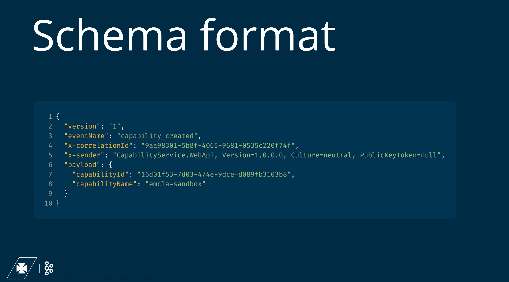
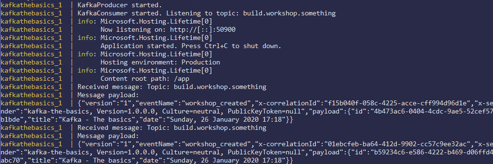
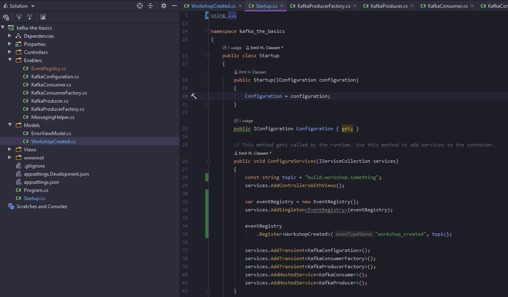
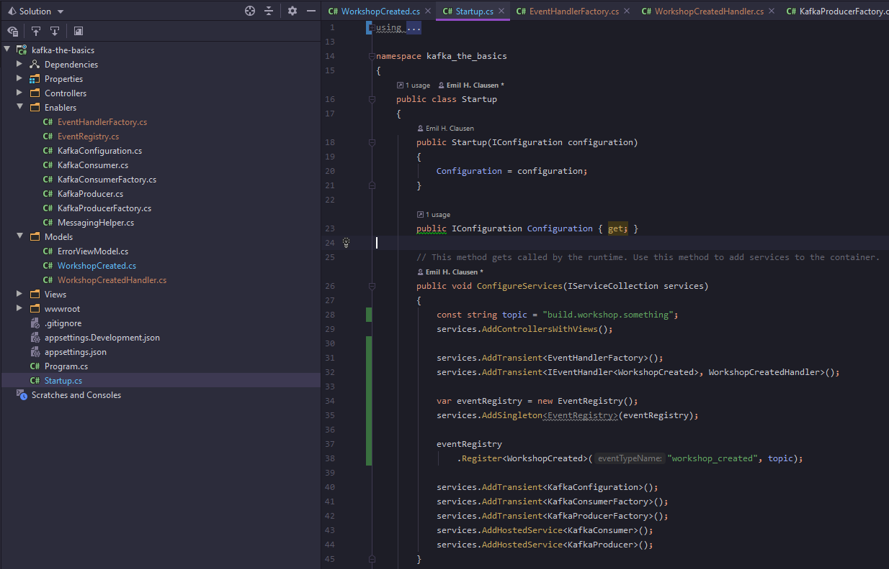
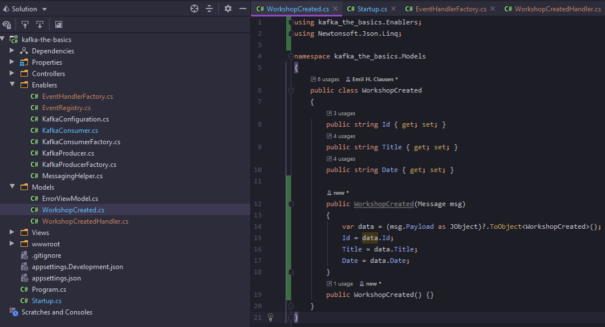

## Kafka in code - Schema format


In this kata, we will be looking at integrating the following schema format:


Open a terminal emulator and navigate to the project folder (dojo/workshops/kafka-deep-dive/4/project). Then execute the following command:

`dotnet add package Newtonsoft.Json`

With the necessary dependency installed, let us go ahead and create "MessagingHelper.cs" in our "Enablers" directory.

```c#
using System.Reflection;
using Newtonsoft.Json;
using Newtonsoft.Json.Serialization;

namespace kafka_deep_dive.Enablers
{
    public class MessagingHelper
    {
        public static string MessageToEnvelope(object payload, string eventName, string correlationId, string version = "1")
        {
            var msg = new Message
            {
                Version = version,
                EventName = eventName,
                XCorrelationId = correlationId,
                XSender = Assembly.GetExecutingAssembly().FullName,
                Payload = payload
            };

            return JsonConvert.SerializeObject(msg, new JsonSerializerSettings
            {
                ContractResolver = new CamelCasePropertyNamesContractResolver()
            });
        }

        public static T MessageToObject<T>(string msg)
        {
            return (T) MessageEnvelopeToMessage(msg).Payload;
        }

        public static Message MessageEnvelopeToMessage(string msg)
        {
            return JsonConvert.DeserializeObject<Message>(msg);
        }
    }

    public class Message
    {
        public string Version { get; set; }
        public string EventName  { get; set; }
        [JsonProperty(PropertyName = "x-correlationId")]
        public string XCorrelationId  { get; set; }
        [JsonProperty(PropertyName = "x-sender")]
        public string XSender { get; set; }
        public object Payload { get; set; }

        public Message(string version, string eventName, string xCorrelationId, string xSender, object payload)
        {
            Version = version;
            EventName = eventName;
            XCorrelationId = xCorrelationId;
            XSender = xSender;
            Payload = payload;
        }
        
        public Message() {}

    }
}
```


With our Message model and helper utilities in place, we can begin using it in our *KafkaProducer* already.

Let us create a test Event, that will function as our Payload in a Message.

```c#
namespace kafka_deep_dive.Models
{
    public class WorkshopCreated
    {
        public string Id { get; set; }
        public string Title { get; set; }
        public string Date { get; set; }
    }
}
```


*workshop_created* will be an Event sent "every time a Workshop is created", which for our testing purposes, is every time our KafkaProducer loop is running.

In *KafkaProducer*, update the *DoWork* method with the following:

```c#
private async Task DoWork(CancellationToken stoppingToken)
{
    const string topic = "build.workshop.something";
    var newWorkshop = new WorkshopCreated
    {
        Id = Guid.NewGuid().ToString(),
        Title = "Kafka - The basics",
        Date = DateTime.Now.ToString("f")
    };
    
    using (var producer = _producerFactory.Create())
    {
        await producer.ProduceAsync(topic: topic, message: new Message<string, string>()
        {
            Key = Guid.NewGuid().ToString(),
            Value = MessagingHelper.MessageToEnvelope(newWorkshop, "workshop_created", Guid.NewGuid().ToString())
        });
    }
}
```

In the top of the KafkaProducer.cs file, put `using kafka_deep_dive.Models;`.


The notable changes are that we using a predefined model for our *Payload*, as well as *Value*.

Let us try and see it in action.

Go to "dojo/workshops/kafka-deep-dive/4" in a terminal emulator, and execute the following:

`docker-compose up --build`

You should hopefully after a couple of seconds see the message in it's envelope in JSON in the console.



Now we are going to do something similar with *KafkaConsumer*.

Currently we're getting the EventName for our Message envelope by manually typing it in, but with no easy way to correlate that to a Class, we gotta do something different. There are many ways to do this, but in most of our microservices in DevEx, we do this by having an Event registry

```c#
using System;
using System.Collections.Generic;
using System.Linq;

namespace kafka_deep_dive.Enablers
{
    public class EventRegistry
    {
        private readonly List<EventRegistration> _registrations = new List<EventRegistration>();

        public IEnumerable<EventRegistration> Registrations => _registrations;

        public EventRegistry Register<TEvent>(string eventTypeName, string topicName)
        {
            _registrations.Add(new EventRegistration
            (
                eventType: eventTypeName,
                eventInstanceType: typeof(TEvent),
                topic: topicName
            ));

            return this;
        }

        public bool IsRegistered(Type eventInstanceType)
        {
            return _registrations.Any(x => x.EventInstanceType == eventInstanceType);
        }

        public string GetTopicFor(string eventType)
        {
            var registration = _registrations.SingleOrDefault(x => x.EventType == eventType);

            if (registration == null)
            {
                throw new Exception($"Error! Could not determine \"topic name\" due to no registration was found for event type \"{eventType}\"!");
            }

            return registration.Topic;
        }

        public string GetTypeNameFor(object eventRegistration)
        {
            var registration = _registrations.SingleOrDefault(x => x.EventInstanceType == eventRegistration.GetType());

            if (registration == null)
            {
                throw new Exception($"Error! Could not determine \"event type name\" due to no registration was found for type {eventRegistration.GetType().FullName}!");
            }

            return registration.EventType;
        }
        
        public IEnumerable<string> GetAllTopics()
        {
            var topics = _registrations.Select(x => x.Topic).Distinct();           

            return topics;
        }
        
        public Type GetInstanceTypeFor(string eventName)
        {
            var registration = _registrations.SingleOrDefault(x => x.EventType == eventName);

            if (registration == null)
            {
                throw new Exception($"Error! Could not determine \"event instance type\" due to no registration was found for type {eventName}!");
            }

            return registration.EventInstanceType;
        }
    }

    public class EventRegistration
    {
        public string EventType { get; }
        public Type EventInstanceType { get; }
        public string Topic { get; }

        public EventRegistration(string eventType, Type eventInstanceType, string topic)
        {
            EventType = eventType;
            EventInstanceType = eventInstanceType;
            Topic = topic;
        }
    }
}
```

Place it in the Enablers directory.

With this registry, we will be able to map an *EventName* to a specific class. Now we will map our *WorkshopCreated* Class to the EventName "workshop_created".

Open "Startup.cs" and find the *ConfigureServices* method.

```c#
public void ConfigureServices(IServiceCollection services)
{
    const string topic = "build.workshop.something";
    services.AddControllersWithViews();
    
    var eventRegistry = new EventRegistry();
    services.AddSingleton<EventRegistry>(eventRegistry);

    eventRegistry
        .Register<WorkshopCreated>("workshop_created", topic);

    services.AddTransient<KafkaConfiguration>();
    services.AddTransient<KafkaConsumerFactory>();
    services.AddTransient<KafkaProducerFactory>();
    services.AddHostedService<KafkaConsumer>();
    services.AddHostedService<KafkaProducer>();
}
```



The EventRegistry is instantiated, and thereafter that instance is added as a Singleton to the ASP framework. This ensures that when any other classes attempts to acquire an instance of the EventRegistry through dependency injection, they will get the same instance.

After that, we register our WorkshopCreated Class, and tell it that the EventName for that Event is "workshop_created".

Since we are now able to map the Payload included in our Message envelope to a specific Class, we can now also create the functionality to map that specific Class to another Class that knows how to handle said Event.

```c#
using System.Collections.Generic;
using System.Threading.Tasks;
using Microsoft.Extensions.DependencyInjection;

namespace kafka_deep_dive.Enablers
{
    public class EventHandlerFactory
    {
        public IEnumerable<IEventHandler<TEvent>> Create<TEvent>(IServiceScope serviceScope)
        {
            var eventHandlers = serviceScope.ServiceProvider.GetServices<IEventHandler<TEvent>>();
            return eventHandlers;
        }

        public IEnumerable<IEventHandler<TEvent>> GetEventHandlersFor<TEvent>(TEvent domainEvent, IServiceScope serviceScope)
        {
            var eventHandlers = Create<TEvent>(serviceScope);
            return eventHandlers;
        }
    }

    public interface IEventHandler<in T>
    {
        Task HandleAsync(T eventInstance);
    }
}
```

Place it in the Enablers directory.


With the EventHandlerFactory in place, let's create a Handler for our WorkshopCreated Class, and make sure it's registered in "Startup.cs".

```c#
using System;
using System.Threading.Tasks;
using kafka_deep_dive.Enablers;

namespace kafka_deep_dive.Models
{
    public class WorkshopCreatedHandler : IEventHandler<WorkshopCreated>
    {
        public async Task HandleAsync(WorkshopCreated eventInstance)
        {
            Console.WriteLine("WorkshopCreatedHandler has been triggered");
            Console.WriteLine($"A workshop was created at '{eventInstance.Date}' with name: {eventInstance.Title}");
        }
    }
}
```


And to add the handler in "Startup.cs", we gotta modify ConfigureServices again:

```c#
public void ConfigureServices(IServiceCollection services)
{
    const string topic = "build.workshop.something";
    services.AddControllersWithViews();

    services.AddTransient<EventHandlerFactory>();
    services.AddTransient<IEventHandler<WorkshopCreated>, WorkshopCreatedHandler>();
    
    var eventRegistry = new EventRegistry();
    services.AddSingleton<EventRegistry>(eventRegistry);

    eventRegistry
        .Register<WorkshopCreated>("workshop_created", topic);

    services.AddTransient<KafkaConfiguration>();
    services.AddTransient<KafkaConsumerFactory>();
    services.AddTransient<KafkaProducerFactory>();
    services.AddHostedService<KafkaConsumer>();
    services.AddHostedService<KafkaProducer>();
}
```

In the top of Startup.cs, add the following line: `using kafka_deep_dive.Models;`



With this specific implementation that we will be using, we will have to give *WorkshopCreated* an additional constructor.

```c#
using kafka_deep_dive.Enablers;
using Newtonsoft.Json.Linq;

namespace kafka_deep_dive.Models
{
    public class WorkshopCreated
    {
        public string Id { get; set; }
        public string Title { get; set; }
        public string Date { get; set; }

        public WorkshopCreated(Message msg)
        {
            var data = (msg.Payload as JObject)?.ToObject<WorkshopCreated>();
            Id = data.Id;
            Title = data.Title;
            Date = data.Date;
        }
        public WorkshopCreated() {}
    }
}
```



This way, we will have full control over how the *WorkshopCreated* object is populated. In this case though, we will just map the data 1 to 1.

Whew, that was a lot. Now with all that set up, we can finally begin to modify our *KafkaConsumer* to make it handle Events registered in *EventRegistry*.

```c#
using System;
using System.Threading;
using System.Threading.Tasks;
using Confluent.Kafka;
using Microsoft.Extensions.DependencyInjection;
using Microsoft.Extensions.Hosting;
using Newtonsoft.Json;

namespace kafka_deep_dive.Enablers
{
    public class KafkaConsumer : IHostedService
    {
        private readonly CancellationTokenSource _cancellationTokenSource = new CancellationTokenSource();
        private readonly KafkaConsumerFactory _consumerFactory;
        private readonly IServiceProvider _serviceProvider;
        private readonly EventRegistry _eventRegistry;
        private readonly EventHandlerFactory _eventHandlerFactory;
        private Task _executingTask;

        public KafkaConsumer(KafkaConsumerFactory consumerFactory, IServiceProvider serviceProvider, EventRegistry eventRegistry, EventHandlerFactory eventHandlerFactory)
        {
            _consumerFactory = consumerFactory;
            _serviceProvider = serviceProvider;
            _eventRegistry = eventRegistry;
            _eventHandlerFactory = eventHandlerFactory;
        }
        
        public Task StartAsync(CancellationToken cancellationToken)
        {
            _executingTask = Task.Factory.StartNew(async () =>
                    {
                        using (var consumer = _consumerFactory.Create())
                        {
                            const string topic = "build.workshop.something";
                            consumer.Subscribe(topic);
                            Console.WriteLine($"KafkaConsumer started. Listening to topic: {topic}");

                            // Consume loop
                            while (!_cancellationTokenSource.IsCancellationRequested)
                            {
                                ConsumeResult<string, string> msg;
                                try
                                {
                                    msg = consumer.Consume(cancellationToken);
                                    using (var scope = _serviceProvider.CreateScope())
                                    {
                                        var message = MessagingHelper.MessageEnvelopeToMessage(msg.Value);
                                        var eventType = _eventRegistry.GetInstanceTypeFor(message.EventName);
                                        dynamic eventInstance = Activator.CreateInstance(eventType, message);
                                        dynamic handlersList = _eventHandlerFactory.GetEventHandlersFor(eventInstance, scope);

                                        foreach (var handler in handlersList)
                                        {
                                            await handler.HandleAsync(eventInstance);
                                        }
                                    }
                                }
                                catch (Exception ex)
                                {
                                    Console.WriteLine($"Consumption of message failed, reason: {ex}");
                                    continue;
                                }

                                try
                                {
                                    await Task.Run(() => consumer.Commit(msg));
                                }
                                catch (Exception ex)
                                {
                                    Console.WriteLine($"Error consuming message: Exception message: {ex.Message}. Raw message: '{msg.Value}'");
                                }
                            }
                        }
                    }, _cancellationTokenSource.Token,
                    TaskCreationOptions.LongRunning, TaskScheduler.Default)
                .ContinueWith(task =>
                {
                    if (task.IsFaulted)
                    {
                        Console.WriteLine("Event loop crashed");
                    }
                }, cancellationToken);
            
            return Task.CompletedTask;
        }

        public async Task StopAsync(CancellationToken cancellationToken)
        {
            try
            {
                _cancellationTokenSource.Cancel();
            }
            finally
            {
                await Task.WhenAny(_executingTask, Task.Delay(-1, cancellationToken));
            }
            
            _cancellationTokenSource.Dispose();
        }
    }
}
```

The changes made are the following:

```c#
private readonly IServiceProvider _serviceProvider;
private readonly EventRegistry _eventRegistry;
private readonly EventHandlerFactory _eventHandlerFactory;

...

public KafkaConsumer(KafkaConsumerFactory consumerFactory, IServiceProvider serviceProvider, EventRegistry eventRegistry, EventHandlerFactory eventHandlerFactory)
{
    _consumerFactory = consumerFactory;
    _serviceProvider = serviceProvider;
    _eventRegistry = eventRegistry;
    _eventHandlerFactory = eventHandlerFactory;
}
        
```

These three attributes has been added to the Class, and to the constructor as well.

```c#
// Consume loop
while (!_cancellationTokenSource.IsCancellationRequested)
{
    ConsumeResult<string, string> msg;
    try
    {
        msg = consumer.Consume(cancellationToken);
        using (var scope = _serviceProvider.CreateScope())
        {
            var message = MessagingHelper.MessageEnvelopeToMessage(msg.Value);
            var eventType = _eventRegistry.GetInstanceTypeFor(message.EventName);
            dynamic eventInstance = Activator.CreateInstance(eventType, message);
            dynamic handlersList = _eventHandlerFactory.GetEventHandlersFor(eventInstance, scope);

            foreach (var handler in handlersList)
            {
                await handler.HandleAsync(eventInstance);
            }
        }
    }
...
```

The consume loop has been expanded upon quite a bit. Now we make use of a *IServiceProvider*, to provider access to dependency injection. We make use of one of the helper methods we made way earlier, *MessageEnvelopeToMessage*, where we take the raw message received from Kafka and give it to *MessageEnvelopeToMessage*. This in turn gives us a *Message* object to work with.

The EventRegistry is then used in conjunction with our new *Message* object, to find a matching Class for the received Message. With the returned *Type*, we make use of some Reflection to create an instance of the *Type* we just got.

Then we look for any handlers registered to that Class, create an instance of the handler, and then call *HandleAsync* on the handler.

Okay.. that was a lot once again. Let's see it in action.

Go to "dojo/workshops/kafka-deep-dive/4" in a terminal emulator, and execute the following:

`docker-compose up --build`

You should in a couple of seconds hopefully see the output from *WorkshopCreatedHandler* instead of the raw json like before.

This implementation of our schema and the usage of it, is rather naive, and expects everything to be done in a certain way. Producing something to a Topic in a format that isn't expected, is quite likely to trip up this implementation of a *KafkaConsumer*.

---

We now have a .NET Core project that just like before can **Consume** from a **Topic** and **Produce** to a **Topic**, but now also have a way of mapping a message to a specific Class, and handle it accordingly.
